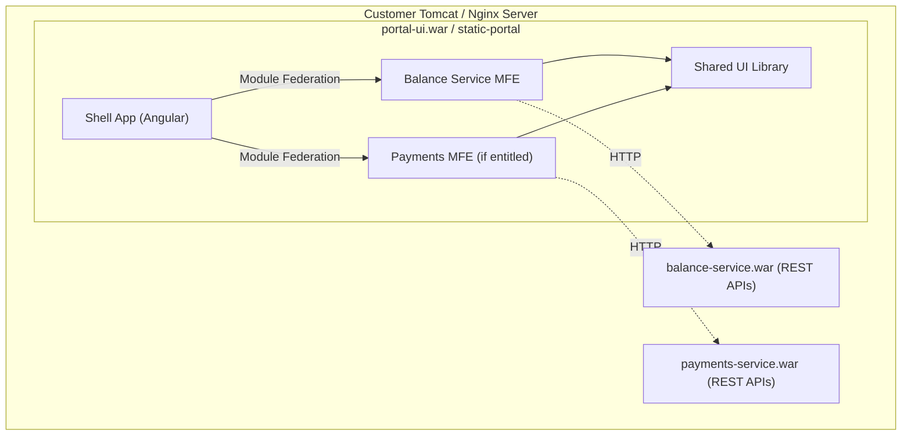

[← Back to Documentation Index](./index.md)

# Micro Frontend (MFE) Architecture Design: Balance Service & Payments

## 1. Executive Summary

This document outlines the Micro Frontend architecture for the new **Balance Service** and **Payments** UIs within the Fusion Cash Management modernization effort. The design builds on learnings from the Liquidity project but introduces key improvements:

- **Decoupled UI deployment** — frontend is not embedded inside backend WARs.
- **Build-time MFE selection** — customer releases contain only licensed MFE code.
- **Monorepo with Nx** — enabling parallel development and shared library management.
- **Angular 22** with Webpack Module Federation (or Angular's native federation).

> [!IMPORTANT]
> **Immediate Priority:** Stand up the Balance Service MFE so that one team (5 devs) can begin development immediately. Payments MFE and legacy integration (Liquidity/ICL) will follow per roadmap.

---

## 2. High-Level Architecture



### Key Components

| Component | Role | Angular Project Type |
|---|---|---|
| **Shell (Portal)** | Host app — navigation, auth, layout, dynamic MFE loading | Application (host) |
| **Balance Service MFE** | Remote module for Balance Service screens | Application (remote) |
| **Payments MFE** | Remote module for Payments screens | Application (remote) |
| **Shared UI Library** | Common components, services, pipes, models, styling tokens | Library |

---

## 3. Monorepo Strategy (Nx Workspace)

**Recommendation: Monorepo with Nx** — this is the industry best practice for Angular MFE projects.

### Workspace Structure

```
fusion-cash-mfe/                          ← Nx Workspace Root
├── apps/
│   ├── shell/                            ← Shell (host) application
│   │   ├── src/
│   │   │   ├── app/
│   │   │   │   ├── app.routes.ts         ← Lazy-loads MFE routes
│   │   │   │   └── app.ts
│   │   │   └── assets/
│   │   │       └── mfe-manifest.json     ← Runtime MFE registry
│   │   ├── module-federation.config.ts
│   │   └── project.json
│   │
│   ├── balance/                          ← Balance Service MFE (remote)
│   │   ├── src/
│   │   │   ├── app/
│   │   │   │   └── remote-entry/
│   │   └── module-federation.config.ts
│   │
│   └── payments/                         ← Payments MFE (remote)
│       ├── src/
│       └── module-federation.config.ts
│
├── libs/
│   ├── shared-core/                      ← Services, Interceptors, Guards
│   ├── shared-theme/                     ← Material 3 Theme, Tokens, SCSS
│   └── shared-ui/                        ← UI Component Library
│
├── docs/                                 ← Workspace Architecture Docs & Guides
└── package.json
```

---

## 4. Module Federation Configuration

### Shell (Host) — `module-federation.config.ts`

```typescript
import { ModuleFederationConfig } from '@nx/module-federation';

const config: ModuleFederationConfig = {
  name: 'shell',
  remotes: [],  // Loaded dynamically from mfe-manifest.json at runtime
  shared: {
    '@angular/core': { singleton: true, strictVersion: true },
    '@angular/common': { singleton: true, strictVersion: true },
    '@angular/router': { singleton: true, strictVersion: true },
  },
};
export default config;
```

### MFE Manifest — `mfe-manifest.json`

```json
{
  "balance": "http://localhost:3001/remoteEntry.js",
  "payments": "http://localhost:3002/remoteEntry.js"
}
```
