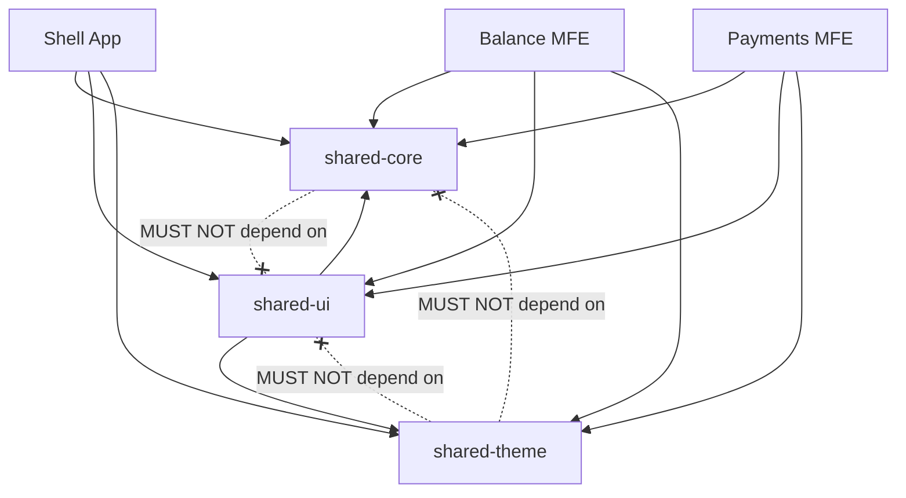

# Local Development, Shared Libs & CI/CD Pipeline

## 1. Shared Library Structure



---

## 2. Local Development Workflow

### Workspace Ports

```
Shell:        http://localhost:4200 (or 3000)
Balance MFE:  http://localhost:3001
Payments MFE: http://localhost:3002
```

### Available Serve Commands

```bash
# Serve Shell with dynamic remotes proxied automatically
npx nx serve shell --devRemotes=balance,payments

# Serve individual MFE standalone
npx nx serve balance
npx nx serve payments
```

### Development Rules
- **Non-buildable libraries** are used for shared libraries so HMR instantly updates all consuming apps on file save without manual rebuilds or restarts.
- **Build config changes** (such as modifying `package.json` or `module-federation.config.ts`) require restarting the `nx serve` process.

---

## 3. CI/CD & Production Build Packaging

- Build output generates static assets for Shell, Balance MFE, and Payments MFE.
- Build-time profiles package only entitled remotes into customer release archives.
