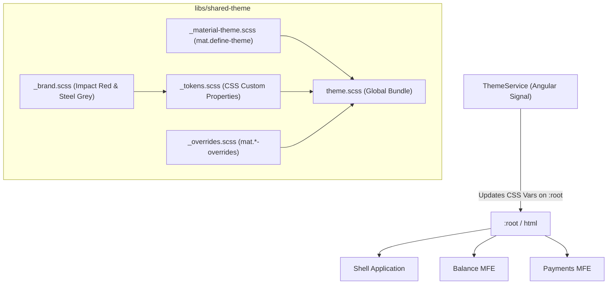

[← Back to Documentation Index](./index.md)

# Tech Mahindra Branding & Angular Material 3 Dynamic Theming Design Document

## 1. Context & Objective

The goal of `libs/shared-theme` is to provide a central, runtime-configurable branding system for the entire Micro Frontend workspace (Shell + Remotes).

### Core Features
- **Primary Brand Color:** Tech Mahindra Impact Red (`#E31837`)
- **Secondary Brand Color:** Steel Grey (`#58595B`)
- **Angular Material 3 Integration:** Standard Material components (`mat-button`, `mat-card`, `mat-form-field`, `mat-datepicker`, etc.) automatically reflect the brand colors and typography.
- **Runtime White-Labeling:** CSS Custom Properties (`--mat-sys-primary`, `--fc-font-family`, etc.) are swapped on `:root` at runtime via `ThemeService` without requiring a rebuild.
- **Configurable TTF Font Loading:** Support loading custom local font files (`.ttf` placed in `assets/fonts/`) configured dynamically.

---

## 2. Theme Architecture Diagram



---

## 3. SCSS File Architecture

The `shared-theme` library structure:

```
libs/shared-theme/src/styles/
├── _brand.scss          # Primary (#E31837), Secondary (#58595B), typography defaults
├── _tokens.scss         # CSS Custom Properties (--mat-sys-primary, --fc-font-family, etc.)
├── _material-theme.scss # Angular Material 3 M3 theme definition (mat.define-theme)
├── _overrides.scss      # Upgrade-safe Angular Material component overrides (mat.button-overrides)
└── theme.scss           # Main entry point imported by host/shell app
```

---

## 4. TTF Custom Font Configuration Guide

To configure custom `.ttf` fonts that can be updated post-build:

### Step 1: Place TTF Font in Assets
Place the `.ttf` font files in `apps/shell/src/assets/fonts/` (e.g. `CustomFont-Regular.ttf`).

### Step 2: Define `@font-face` in `shared-theme`
In `libs/shared-theme/src/styles/_tokens.scss`:

```scss
@font-face {
  font-family: 'AppCustomFont';
  src: url('/assets/fonts/CustomFont-Regular.ttf') format('truetype');
  font-weight: normal;
  font-style: normal;
  font-display: swap;
}

:root {
  // Configurable Font Family custom property
  --fc-font-family: 'AppCustomFont', Roboto, sans-serif;
  
  // Set system font for body and material
  font-family: var(--fc-font-family);
}
```

### Step 3: Runtime Font Swapping via ThemeService
When fetching a tenant configuration from the backend, update `--fc-font-family`:

```typescript
// libs/shared-theme/src/lib/theme.service.ts
export interface TenantThemeConfig {
  primaryColor: string;
  secondaryColor: string;
  fontFamily?: string;
  fontUrl?: string;
}

@Injectable({ providedIn: 'root' })
export class ThemeService {
  applyTenantTheme(config: TenantThemeConfig) {
    const root = document.documentElement;
    if (config.primaryColor) {
      root.style.setProperty('--mat-sys-primary', config.primaryColor);
      root.style.setProperty('--fc-color-primary', config.primaryColor);
    }
    if (config.fontFamily) {
      root.style.setProperty('--fc-font-family', config.fontFamily);
    }
  }
}
```
