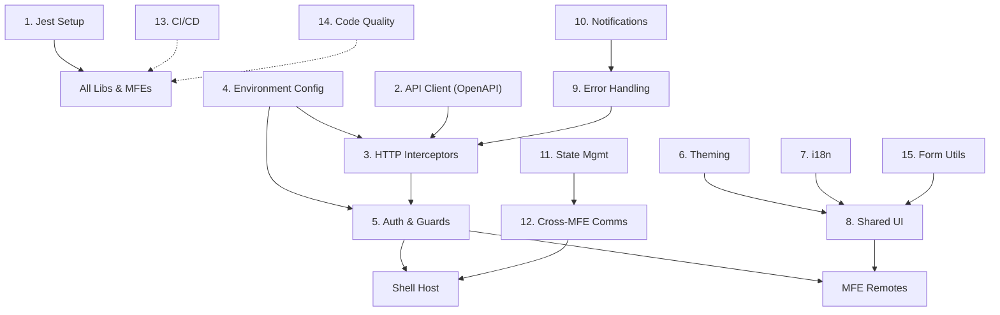

# MFE Foundation Modules — Prioritization & Roadmap

> Foundational layers to add to the Nx MFE monorepo so the team can start picking stories and delivering immediately.

---

## Module Inventory

### Legend

| Priority | Meaning |
|----------|---------|
| 🔴 P0 | **Blocker** — Team cannot write real stories without this |
| 🟠 P1 | **Critical** — Needed within Sprint 1–2 |
| 🟡 P2 | **Important** — Can be added incrementally |
| 🟢 P3 | **Nice-to-have** — Enhances DX, can be deferred |

---

### 🔴 P0 — Team Blockers (Must have before first story)

| # | Module | Nx Library | Description |
|---|--------|------------|-------------|
| 1 | **Unit Testing (Jest)** | workspace config | Jest setup with Angular presets, test utilities, coverage thresholds. Every MFE and lib should be testable from day 1. |
| 2 | **API Client Generation (OpenAPI)** | `libs/api-client` | Auto-generate TypeScript services, models, and enums from Swagger/OpenAPI YAML. Components consume typed services — zero hand-written HTTP calls. |
| 3 | **HTTP Interceptor Chain** | `libs/shared-core` | Auth token injection, global error handling, loading spinner trigger, request/response logging, retry with backoff. Every API call flows through this. |
| 4 | **Environment & Runtime Config** | `libs/shared-core` | Per-environment configs (dev/QA/staging/prod). Runtime config loaded via `APP_INITIALIZER` — no hardcoded URLs. Feature flags support. |
| 5 | **Auth Guards & Token Management** | `libs/auth` | JWT/OAuth token storage, refresh logic, route guards (`canActivate`, `canMatch`), role-based access. Shell manages auth, MFEs consume it. |
| 6 | **Theming (Angular Material + CSS Vars)** | `libs/shared-theme` | Angular Material with custom theme driven by CSS custom properties. Branding-ready: swap variables at runtime for white-labeling. |
| 7 | **i18n (ngx-translate)** | `libs/shared-i18n` | JSON key-value based multi-language support. Each MFE has its own translation files. Shared lib provides `TranslateModule` config + language switcher service. |

---

### 🟠 P1 — Sprint 1–2 (Needed very soon)

| # | Module | Nx Library | Description |
|---|--------|------------|-------------|
| 8 | **Shared UI Component Library** | `libs/shared-ui` | Reusable components: buttons, modals, data tables, form controls, empty states, loading skeletons. All themed via `shared-theme`. |
| 9 | **Global Error Handling & Logging** | `libs/shared-core` | Global `ErrorHandler`, structured console/remote logging, error boundary component. Consistent error UX across all MFEs. |
| 10 | **Notification / Toast System** | `libs/shared-ui` | Snackbar/toast service for success, error, warning, info messages. Used by interceptors and components alike. |
| 11 | **Agentic Development Setup** | `.agents/` | AI coding assistant configuration — workspace rules (coding conventions, naming patterns, architecture constraints), skills (component generation, test scaffolding, API integration workflows), and agent-friendly project documentation. Enables team to use AI tools (Antigravity, Copilot, Cursor) with full project context, consistent output, and enforced patterns. |

---

### 🟡 P2 — Important, add incrementally

| # | Module | Nx Library | Description |
|---|--------|------------|-------------|
| 11 | **State Management Pattern** | `libs/shared-core` | Lightweight signal-based stores or NgRx (if complex). Shared user context, session state, cross-MFE communication state. |
| 12 | **Cross-MFE Communication** | `libs/shared-core` | Event bus (CustomEvents or RxJS Subject) for shell ↔ remote messaging: user context, navigation events, notifications. |
| 13 | **CI/CD Pipeline (GitHub Actions)** | `.github/workflows/` | Affected-only builds, per-MFE deploy, lint/test/build gates, artifact publishing. Separate workflows for shell vs remotes. |
| 14 | **Linting & Code Quality Gates** | workspace config | Strict ESLint rules, Prettier, Nx module boundaries (`@nx/enforce-module-boundaries`), commit hooks (husky + commitlint). |
| 15 | **Form Utilities** | `libs/shared-forms` | Typed reactive form builders, common validators (email, phone, currency, date range), standardized error display pattern. |

---

### 🟢 P3 — Nice-to-have, enhances DX

| # | Module | Nx Library | Description |
|---|--------|------------|-------------|
| 16 | **Storybook / Component Docs** | workspace config | Visual component catalog for `shared-ui`. Designers and QA can review components in isolation. |
| 17 | **Loading / Skeleton States** | `libs/shared-ui` | Skeleton screen components for tables, cards, forms. Improves perceived performance during API calls. |
| 18 | **Security Headers & CSP** | deployment config | Content-Security-Policy headers, XSS prevention, CORS hardening for production. |
| 19 | **Performance Monitoring** | `libs/shared-core` | Web Vitals tracking, bundle size budgets, lazy load analytics. |
| 20 | **Mock Server (MSW)** | dev tooling | Mock Service Worker for frontend-first development when APIs aren't ready. Dev can work independently of backend. |

---

## Dependency Graph



---

## Proposed Nx Library Structure

```
fusion-cash-mfe/
├── apps/
│   └── shell/
├── balance/                    # Remote MFE
├── payments/                   # Remote MFE
│
├── libs/
│   ├── shared-core/            # HTTP interceptors, env config, error handling, 
│   │                           #   cross-MFE comms, state utils
│   ├── shared-theme/           # Angular Material theme, CSS variables,
│   │                           #   branding tokens
│   ├── shared-ui/              # Reusable components, notifications,
│   │                           #   skeletons, layouts
│   ├── shared-i18n/            # ngx-translate config, language service,
│   │                           #   translation loader
│   ├── shared-forms/           # Form builders, validators, error display
│   ├── auth/                   # Guards, token service, login flow
│   └── api-client/             # OpenAPI-generated services & models
│       ├── generated/          #   Auto-generated (do NOT edit)
│       └── openapi-spec/       #   Source YAML files
│
├── tools/
│   └── openapi-codegen/        # Script to regenerate api-client
│
└── .github/
    └── workflows/              # CI/CD pipelines
```

---

## Proposed Implementation Order (Phased)

### Phase 1 — "Team Can Write Code" (Week 1)

```mermaid
gantt
    title Phase 1 - Foundation
    dateFormat  X
    axisFormat %s

    section Setup
    Jest Testing Setup           :done, 0, 1
    Environment Config           :done, 0, 1
    ESLint + Prettier + Boundaries :done, 0, 1

    section Core
    HTTP Interceptor Chain       :active, 1, 2
    Auth Guards & Token Mgmt     :active, 1, 2
    API Client (OpenAPI Gen)     :active, 1, 2
    Angular Material Theming     :active, 1, 2
    ngx-translate i18n           :active, 1, 2
```



| Day | Work |
|-----|------|
| 1–2 | Jest setup, env config, linting rules, module boundaries |
| 3–4 | HTTP interceptors, auth guards, token management |
| 5–6 | Angular Material theming + shared-theme library |
| 7 | ngx-translate + shared-i18n setup |
| 8 | OpenAPI codegen setup + first API integration |

### Phase 2 — "Team Can Build Features" (Week 2)

| Day | Work |
|-----|------|
| 1–2 | Shared UI library (button, modal, table stubs) |
| 3–4 | Error handling + notification/toast system |

### Phase 3 — "Team Can Ship" (Week 3)

| Day | Work |
|-----|------|
| 1–2 | CI/CD GitHub Actions (affected builds, per-MFE deploy) |
| 3 | Cross-MFE communication + state pattern |
| 4 | Form utilities library |
| 5 | Documentation + Storybook (optional) |

---

## Discussion Points

> **Decisions needed before implementation:**

1. **State Management:** Lightweight signals-based stores vs. NgRx? 
   - *Recommendation:* Start with Angular Signals + simple services. Add NgRx only if complexity warrants it.

2. **Auth Strategy:** JWT with refresh tokens vs. OAuth2/OIDC flow?
   - *Recommendation:* Build the token service as an abstraction. Swap implementation later without touching MFEs.

3. **OpenAPI Codegen Tool:** `openapi-generator-cli` (Java-based) vs. `@openapitools/openapi-generator-cli` (npm) vs. `orval` (TypeScript-native)?
   - *Recommendation:* `@openapitools/openapi-generator-cli` with `typescript-angular` generator for Angular-native services.

4. **Component Library Scope:** Build from scratch vs. wrap Angular Material components?
   - *Recommendation:* Wrap Angular Material. Don't reinvent buttons and modals. Focus shared-ui on domain-specific patterns.

5. **i18n Loading Strategy:** Bundled JSON vs. lazy-loaded per MFE vs. API-served?
   - *Recommendation:* Per-MFE lazy-loaded JSON files. Each team owns their translations.

6. **Mock Strategy for Frontend-First Dev:** MSW (Mock Service Worker) vs. json-server vs. in-memory API?
   - *Recommendation:* MSW — intercepts at network level, works in browser and tests, zero backend dependency.

---

## Next Steps

Once we align on priorities and decisions above, I'll POC each module on the current MFE setup and generate a **setup guide** (like the MFE guide) for each one.

**Suggested first pick:** Module **#1 (Jest)** — it's foundational and every other module needs tests.
